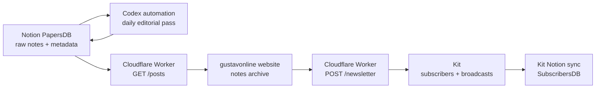

# Newsletter, Notion, Codex and Cloudflare Plan

## Goal

The system should feel almost automatic:

1. Gustav writes a paper/note in Notion.
2. Codex checks `PapersDB` on a schedule.
3. Codex fills metadata and marks coherent drafts as `Ready`.
4. Cloudflare exposes published notes to `gustavonline`.
5. Cloudflare sends website signups to Kit.
6. Kit syncs subscribers to Notion through its own Notion integration.
7. Gustav keeps final control over publishing and sending while the workflow is still new.

## Architecture



## Notion

Writing database:

- Name: `PapersDB`
- Data source: `collection://23fa9322-f9ee-4ffc-8c5a-a44a88b281e9`
- Simple writing view: `Write`

Subscriber database:

- Name: `SubscribersDB`
- Managed by Kit's Notion sync.
- Do not write subscriber rows from the Cloudflare Worker.

Gustav's daily workflow:

1. Open `PapersDB`.
2. Use the `Write` view.
3. Create a new page.
4. Fill `Title`.
5. Write the page body.
6. Leave the rest to Codex.

## PapersDB Schema

Human-facing field:

- `Title`

Automation/system fields:

- `Status`: `Draft`, `Ready`, `Published`, `Archived`
- `Publish date`
- `Slug`
- `Summary`
- `Tags`: `AI`, `IT architecture`, `client work`, `templates`, `life`
- `Send as newsletter`
- `Kit broadcast id`
- `Public URL`
- `Last processed`

## Codex Automation

Canonical instructions live in:

- `docs/codex-papers-automation.md`

Version one behavior:

- Fill missing metadata.
- Move coherent drafts to `Ready`.
- Do not publish automatically.
- Do not send email automatically.
- Return a short report.

Later behavior can be upgraded after the flow is trusted:

- Move approved `Ready` notes to `Published`.
- Prepare Kit draft broadcasts.
- Eventually send through Kit if Gustav explicitly wants full automation.

## Cloudflare Worker

Cloudflare should stay a lightweight glue layer.

Endpoints:

```txt
GET /posts
POST /newsletter
```

`GET /posts`:

- Reads `PapersDB`.
- Filters `Status = Published`.
- Returns JSON for the portfolio.

Expected response:

```json
{
  "posts": [
    {
      "title": "Why AI needs architecture",
      "summary": "AI becomes useful when it is connected to workflows and decisions.",
      "date": "2026-06-14",
      "url": "https://gustavonline.com/notes/why-ai-needs-architecture"
    }
  ]
}
```

`POST /newsletter`:

- Receives signups from the website.
- Validates the email.
- Adds the subscriber to Kit.
- Lets Kit sync the subscriber to Notion.
- Returns `{ "ok": true }`.

Expected request:

```json
{
  "email": "person@example.com",
  "source": "gustavonline"
}
```

Frontend environment variables:

```bash
VITE_WRITING_ENDPOINT=https://worker.example.workers.dev/posts
VITE_NEWSLETTER_ENDPOINT=https://worker.example.workers.dev/newsletter
```

## Kit

Kit is the chosen email platform.

Kit handles:

- Subscriber list.
- Subscriber-to-Notion sync.
- Unsubscribe links.
- Deliverability.
- Broadcast sending.
- Future creator/newsletter features.

Cloudflare should not self-host email. It should only route signups and, later, trigger/prepare Kit broadcasts.

## Build Phases

### Phase 1: Codex editorial automation

- Use `docs/codex-papers-automation.md`.
- Process new Notion pages.
- Fill metadata.
- Mark good drafts as `Ready`.

### Phase 2: Cloudflare `/posts`

- Create Worker.
- Read published Notion pages.
- Connect `VITE_WRITING_ENDPOINT`.
- Show real notes on the website.

### Phase 3: Cloudflare `/newsletter`

- Connect website signups to Kit.
- Enable Kit's Notion sync for `SubscribersDB`.
- Connect `VITE_NEWSLETTER_ENDPOINT`.

### Phase 4: Kit draft automation

- Codex or Cloudflare prepares Kit draft broadcasts for notes marked `Send as newsletter`.
- Gustav manually reviews/sends in Kit.

### Phase 5: Full automation

- Only after trust is established.
- Published newsletter papers can be sent through Kit automatically.
- Automation stores `Kit broadcast id` and reports what happened.
